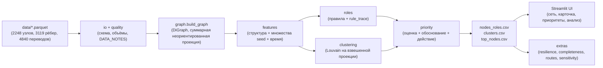

# Граф денег

Локальный инструмент для AML-аналитика: по обезличенной выгрузке исходящих внутрибанковских переводов он строит направленный граф, присваивает каждому узлу проверяемую гипотезу о роли и ранжирует узлы для дальнейшей проверки. Результат отвечает на рабочий вопрос: кого из наблюдаемых клиентов смотреть первым и почему. Роли отражают признаки в ограниченной выборке, а не установленный статус клиента.

Вход: `data/nodes.parquet`, `data/edges.parquet`, `data/transactions.parquet` из предоставленного архива. Выгрузка охватывает 81 исходный gid, 2 248 узлов, 3 119 агрегированных рёбер и 4 840 переводов за июль 2026 года.

## Запуск на Windows PowerShell

Распакуйте архив так, чтобы три parquet-файла находились прямо в `data/`. Из корня репозитория выполните:

```powershell
python -m venv .venv
.\.venv\Scripts\python.exe -m pip install -r requirements.txt
.\.venv\Scripts\python.exe run_pipeline.py
.\.venv\Scripts\python.exe scripts/check_outputs.py --twice --final
.\.venv\Scripts\python.exe -m pytest -q
.\.venv\Scripts\streamlit.exe run app/main.py --server.headless true
```

После последней команды откройте локальный адрес, показанный Streamlit. В боковой панели введите `gid` или выберите строку на вкладке «Приоритеты». Карточка показывает все сработавшие и несработавшие условия роли, наблюдаемые потоки, контрагентов и переводы по дням. Вкладка «Сеть» показывает направления переводов и окружение выбранного узла.

Для проверки секретов на машине с Git Bash:

```powershell
& 'C:\Program Files\Git\bin\bash.exe' scripts/secret_scan.sh
```

Пайплайн полностью локален и не требует API-ключа. Необязательный текстовый ассистент в интерфейсе появляется только при наличии `OPENAI_API_KEY` в окружении или в локальном, игнорируемом Git файле `.env`.

## Как получается результат

`io` проверяет схему parquet, `quality` сверяет размеры и суммы, `graph` строит направленный граф с учётом изолированных seed. Затем `features` и `temporal` считают структурные, потоковые и временные признаки; `roles` применяет правила; `clustering` выделяет сообщества Louvain на явно суммированной неориентированной проекции; `priority` создаёт ранжирование и текстовое объяснение. Полный пересчёт предоставленного набора в проверенном чистом клоне занял 20,96 с, что ниже лимита 5 минут из задания. Расчёт детерминирован при `seed=42`.

Правила проверяются в порядке таблицы. Первая прошедшая роль становится основной, остальные успешные сохраняются как вторичные. `rule_trace` хранит **все** проверки, включая неуспешные. Пороговые значения ниже взяты из `moneygraph/thresholds.py`; детали вычисления приведены в [методике](docs/METHODOLOGY.md).

| Роль | Критерий основной роли |
|---|---|
| `coordinator` — кандидат в координаторы | Достижимость от ≥3 seed, ≥3 питающие ветви и прирост схождения ≥1 одновременно. |
| `consolidator` — признаки консолидации | ≥4 разных наблюдаемых плательщика. |
| `distributor` — признаки веерного распределения | Исходящие наблюдаемы и есть ≥6 разных получателей. |
| `transit` — признаки транзита | Исходящие наблюдаемы, узел не seed, входящий поток положителен, `out_sum / in_sum` от 0,7 до 1,3, входящая и исходящая степени ≤3. |
| `terminal` — кандидат в конечные получатели | Исходящие наблюдаемы, узел не seed и не на границе выгрузки, входящий поток ≥50 000 KZT, `out_sum / in_sum` ≤0,3 либо исходящих нет, доля поздних поступлений <0,5. |
| `boundary` — граница выгрузки | Глубина 4, исходящих в выгрузке нет, ни одно предыдущее правило не прошло. |
| `peripheral` — периферия | Ни одно предыдущее правило не прошло. |

`role_score` лежит в диапазоне 0–1 и показывает выраженность условий выбранной роли. Для ранга используется формула:

```text
priority_score = novelty × (
    0.35 × role_weight × role_score
  + 0.30 × pct(seed_flow_in)
  + 0.20 × pct(max(in_sum, out_sum))
  + 0.15 × pct(betweenness)
)
```

`pct` — процентный ранг среди узлов со средним рангом при равенстве. `novelty` равна 0,7 для исходных seed и 1,0 для остальных. Веса ролей: `coordinator` 1,0; `consolidator` 0,9; `distributor` 0,75; `transit` и `terminal` 0,6; `boundary` 0,4; `peripheral` 0,1. `why` называет два крупнейших слагаемых и рекомендуемое действие.

## Выходные файлы

| Файл | Содержание |
|---|---|
| `outputs/nodes_roles.csv` | Основная роль, сила признаков, кластер, приоритет и краткое свидетельство для каждого из 2 248 gid. |
| `outputs/clusters.csv` | Размер, число seed, внутренний объём переводов, ключевые gid и гипотеза о каждом кластере. |
| `outputs/top_nodes.csv` | Топ-30 узлов с рангом и объяснением `why`. |
| `outputs/run_meta.json` | Времена этапов, размеры данных, распределение ролей и проверки качества. |
| `outputs/node_features.parquet` | Полные признаки и `rule_trace` для карточек узлов; создаётся локально и не хранится в Git. |
| `outputs/graph_edges.parquet` | Агрегированные направленные рёбра для интерфейса; создаётся локально и не хранится в Git. |
| `outputs/resilience.csv` | Размер компонент после удаления узлов по разным стратегиям. |
| `outputs/completeness.csv` | Узлы с `censored` или `inflow_incomplete` независимо от роли: запрос исходящих для границы, входящих для неполного входа, обоих направлений при сочетании флагов. Интерфейс показывает и выгружает весь список. |
| `outputs/routes.csv` | Совместимые по датам двухшаговые цепочки через транзитный узел, отдельные однодневные кандидаты и структурные циклы длины 2–4. |
| `outputs/sensitivity.csv` | Анализ изменения порогов; автоматически рассчитывается после основных выгрузок. Ошибка этого этапа не прерывает основной расчёт; при отсутствии файла вкладка «Анализ» показывает пояснение. |

## Ограничения данных и трактовка

Граф построен **только по исходящим** переводам от 81 seed на четыре перехода. У 444 узлов глубины 4 исходящие не выгружались; отсутствие ребра у них нельзя считать признаком конечного получателя. Такие узлы получают метку границы, если не прошли более раннее структурное правило. Входящий поток по всей сети является нижней оценкой: переводы из-за пределов обхода отсутствуют, особенно у seed. В текущей проверке данных 377 узлов имеют наблюдаемый исходящий поток выше входящего; это признак неполноты выборки, а не ошибка баланса.

Переводы меньше 5 000 KZT отсутствуют из-за **порога выгрузки**, а не из-за аналитического порога. Период ограничен июлем 2026 года. Поздний входящий перевод мог продолжиться в августе, поэтому правило конечного получателя проверяет долю поступлений у правой границы периода. Даты имеют точность до дня, порядок переводов внутри дня неизвестен. Данные не содержат персональных атрибутов или размеченных истинных ролей, поэтому выводы остаются гипотезами для проверки.

`fast_through_share` — доля исходящей суммы, отправленной в дни наблюдаемых поступлений или в следующие два дня. Входящие и исходящие суммы не сопоставляются: показатель отражает близость активности во времени, а не долю конкретных поступлений, переданных дальше. Значение 100% не означает, что весь исходящий поток профинансирован наблюдаемыми недавними поступлениями.

В `routes.csv` тип `transit_chain` означает наличие пар дат с интервалом 1–2 дня; `same_day_candidate` — совпадение в один день без известного порядка. `n_occurrences` считает различные пары `(дата входа, дата выхода)` для данного пути и типа; несколько переводов в один день сначала суммируются. `days_span` — минимальный интервал среди этих пар. `min_leg_kzt` — максимум меньшей из двух дневных сумм по совместимым парам; суммы разных пар не складываются, поскольку пары могут использовать общие переводы. Это не трассировка происхождения средств. Для `structural_cycle` поле `min_leg_kzt` содержит минимальную месячную сумму ребра, а `days_span` и `n_occurrences` пусты: наличие цикла в агрегированном графе не подтверждает движение денег по нему во времени.

## Проверка чувствительности

Отдельный анализ изменяет каждый градуируемый порог до 75% и 125% исходного значения и сравнивает роли и состав топ-20. На полном расчёте из сырых признаков проверено 26 сценариев. Только уменьшение `CONS_PAYERS_MIN` до 75% дало сходство топ-20 ниже 0,7: изменились 106 ролей, коэффициент Жаккара равен 0,667. Порог консолидации стоит рассматривать как чувствительный при ручной проверке кандидатов. Результат воспроизводится функцией `moneygraph.extras.sensitivity.run` на признаках до округления; этот анализ не входит в обязательный запуск.

## Масштабирование до миллиона узлов

На графе порядка 1 млн узлов точная посредническая центральность и полный `spring_layout` станут дорогими. Агрегацию переводов следует выполнять по секциям в DuckDB или Spark; достижимость от seed считать пакетным либо инкрементальным обходом; сообщества — алгоритмом Leiden/igraph; центральность — приближённо на фиксированной выборке. Для интерфейса нужен серверный выбор подграфа вокруг gid и заранее сохранённые координаты, а не передача всего графа в браузер. Эти изменения описывают путь масштабирования и не требуются для текущей локальной выгрузки.

## Схема



Статическая версия: [схема решения](docs/solution_diagram.png).
