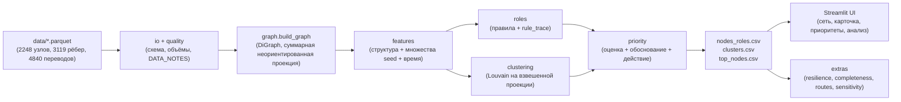

```mermaid
flowchart LR
    A["data/*.parquet<br/>(2248 узлов, 3119 рёбер, 4840 переводов)"] --> B["io + quality<br/>(схема, объёмы, DATA_NOTES)"]
    B --> C["graph.build_graph<br/>(DiGraph, суммарная неориентированная проекция)"]
    C --> D["features<br/>(структура + множества seed + время)"]
    D --> E["roles<br/>(правила + rule_trace)"]
    D --> F["clustering<br/>(Louvain на взвешенной проекции)"]
    E --> G["priority<br/>(оценка + обоснование + действие)"]
    F --> G
    G --> H["nodes_roles.csv<br/>clusters.csv<br/>top_nodes.csv"]
    H --> I["Streamlit UI<br/>(сеть, карточка, приоритеты, анализ)"]
    H --> J["extras<br/>(resilience, completeness, routes, sensitivity)"]
```
